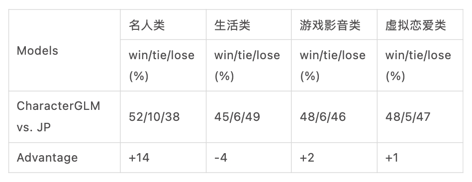

# CharacterGLM-6B

为了满足人多样化的社交需求、实现社交对象的高度可定制化，聆心智能团队研发了 CharacterGLM，这是一款可自由定制角色进行对话交互的模型。CharacterGLM 基于 ChatGLM 构建，具有三个不同参数规模的版本：6B、12B 和 66B。我们将 CharacterGLM-6B 模型开源，以支持AI角色扮演以及AI在心理学领域的研究和应用。此外，我们近期将发布技术报告，披露更多 CharacterGLM 模型细节，供学术界以及工业界研究使用。

## 下载和使用

我们在Hugginface平台上开源了我们的模型参数，可以通过Transformers库直接使用：

*https://huggingface.co/LingxinAI/CharacterGLM-6b*

```python
# 模型加载
from transformers import AutoTokenizer, AutoModel
model_name_or_path = "LingxinAI/CharacterGLM-6b"
tokenizer = AutoTokenizer.from_pretrained(model_name_or_path, trust_remote_code=True)
model = AutoModel.from_pretrained(model_name_or_path, trust_remote_code=True)
model = model.cuda()

# 生成
text = "..."
inputs = tokenizer(text, return_tensors='pt')
generation_config = {
    "top_k": 100,
    "top_p": 0.9,
    "temperature": 0.9,
    "do_sample": True
}
output_tensor = model.generate(**inputs.to(model.device), **generation_config)
output_ids = output_tensor[0, inputs["input_ids"].shape[1]: ].tolist()
output = tokenizer.decode(output_ids)

# TODO: 输入格式示例
```

同时，也欢迎调用我们的API接口：

*https://bigmodel.cn/dev/api#characterglm*

## 性能评估

我们采用人工交互的方式评测CharacterGLM与业界最强的竞争对手（以下简称JP）的性能。

我们定制了数十个角色，它们的类型分布于名人类、生活类、游戏影音类和虚拟恋爱类。我们要求标注者与每个角色至少交互20轮，每轮对话由两个模型生成回复。

标注者选择胜出的回复继续展开对话，若回复偏好相同则随机选择。我们按角色类别统计两个模型的win/tie/lose比率.

结果如表1所示，CharacterGLM在大多数类别上的表现均优于JP。



更详尽的性能评估请参考我们的技术报告。

## 交互样例

下面展示了从交互测评数据中采样的名人类角色的交互样例。


可以看到我们的模型能取得更好更自然的交互表现。

请查阅我们的技术报告以获取更多且更具体的交互样例。
